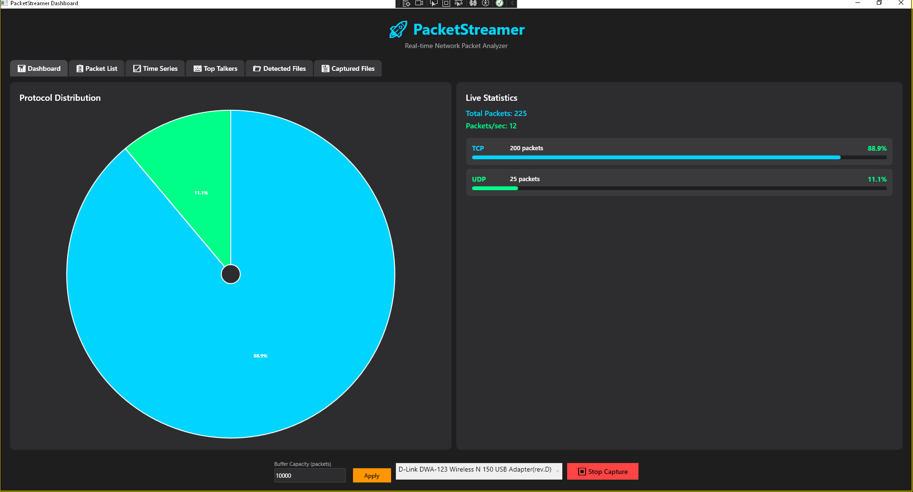
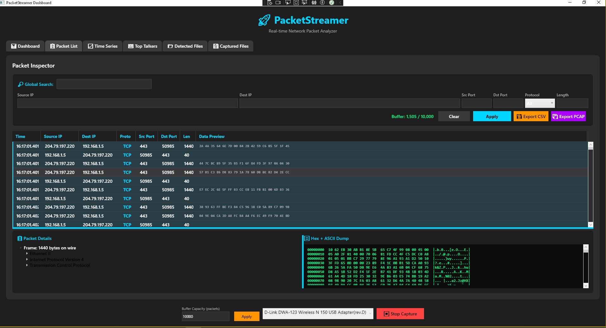
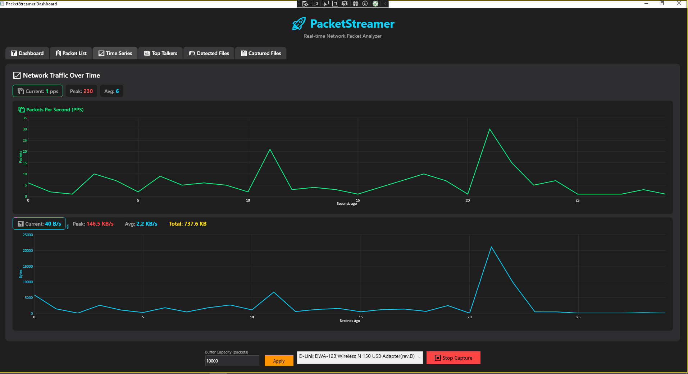
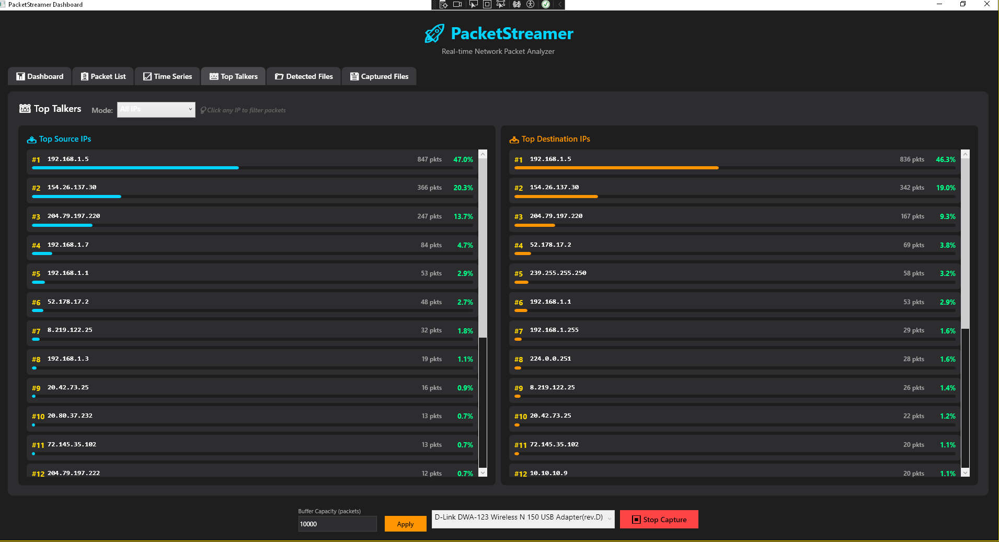

# 🚀 PacketStreamer

[](LICENSE)
[](https://isocpp.org/)
[](https://dotnet.microsoft.com/)
[](https://www.microsoft.com/windows)

**A High-Performance Network Packet Analyzer and Streamer**

PacketStreamer is a blazing-fast, real-time network monitoring tool built with a hybrid **C++ (Npcap)** and **C# (WPF)** architecture. It captures, parses, filters, and visualizes network traffic with enterprise-grade performance, designed to handle high-throughput environments without dropping packets.

---

## ✨ Key Features

- ⚡ **High-Performance Engine:** C++ core with Npcap for zero-overhead packet capture.
- 🔄 **Ring Buffer Architecture:** Custom memory-efficient ring buffer to handle millions of packets without GC pressure or memory leaks.
- 📊 **Real-Time Dashboard:** Live Pie Charts and Time Series (PPS & BPS) using LiveCharts.
- 🔍 **Advanced Filtering:** Multi-layer filtering by IP, Port, Protocol, Length, and even deep payload inspection (Hex/ASCII).
- 👑 **Top Talkers Analysis:** Real-time identification of the most active Source and Destination IPs.
- 📁 **Protocol Detection:** Automatic detection of HTTP (URLs), DNS (Domains), and TLS (SNI) traffic.
- 💾 **File Extraction:** Automatically extracts and saves HTTP files (HTML, CSS, JS, Images) locally for offline analysis.
- 📤 **Export Capabilities:** Export filtered or full captures to standard **PCAP** (Wireshark compatible) and **CSV** formats.
- 🎨 **Modern UI:** Dark-themed, responsive WPF interface with detailed Hex/ASCII packet inspection.

---

## 🏗️ Architecture

```text
┌─────────────────┐     ┌──────────────────────┐     ┌─────────────────────┐
│   Npcap Driver  │────▶│  C++ Core (DLL)      │────▶│  C# WPF Dashboard   │
│   (Kernel)      │     │  - Raw Capture       │     │  - Real-time Charts │
│                 │     │  - Header Parsing    │     │  - Ring Buffer Mgmt │
└─────────────────┘     │  - Background Queue  │     │  - Advanced Filtering│
                        └──────────────────────┘     └─────────────────────┘

## 📦 Prerequisites
Windows 10/11 (Administrator privileges required for packet capture).
Npcap: Install the latest version. Make sure to check "Install Npcap in WinPcap API-compatible Mode" during installation.
Npcap SDK: Required only if you want to recompile the C++ core.
Visual Studio 2022 with C++ Desktop Development and .NET Desktop Development workloads.
.NET 8.0 SDK.
---

## 🛠️ How to Build
Clone the repository:
bash

12
Open PacketStreamer.sln in Visual Studio.
Build the C++ Core:
Set PacketStreamer_Core as the Startup Project (or build it manually).
Ensure the configuration is set to x64 and Debug (or Release).
Build the project.
Copy the DLL:
Copy PacketStreamer_Core.dll from PacketStreamer_Core\x64\Debug\ (or Release) to PacketStreamer_Dashboard\bin\Debug\net8.0\.
Run the Dashboard:
Set PacketStreamer_Dashboard as the Startup Project.
Run Visual Studio as Administrator (Required for Npcap access).
Press F5 to start capturing!
---

## 📸 Screenshots

| Real-time Dashboard | Advanced Packet Filtering |
| :---: | :---: |
|  |  |

| Top Talkers & Time Series | Hex/ASCII Packet Inspector |
| :---: | :---: |
|  |  |
---

## ⚠️ Important Notes
HTTPS Encryption: Like all standard packet sniffers, PacketStreamer can only inspect the payload of unencrypted traffic (e.g., HTTP Port 80, DNS Port 53). HTTPS (Port 443) payload is encrypted, though TLS SNI (domain names) can still be extracted from the Client Hello handshake.
Administrator Rights: The application must be run as Administrator to access the Npcap driver.
---

## 🤝 Contributing
Contributions, issues, and feature requests are welcome! Feel free to check the issues page.
---

## 📜 License
This project is licensed under the MIT License - see the LICENSE file for details.
Made with ❤️ by [Mr Zakarya]
---
